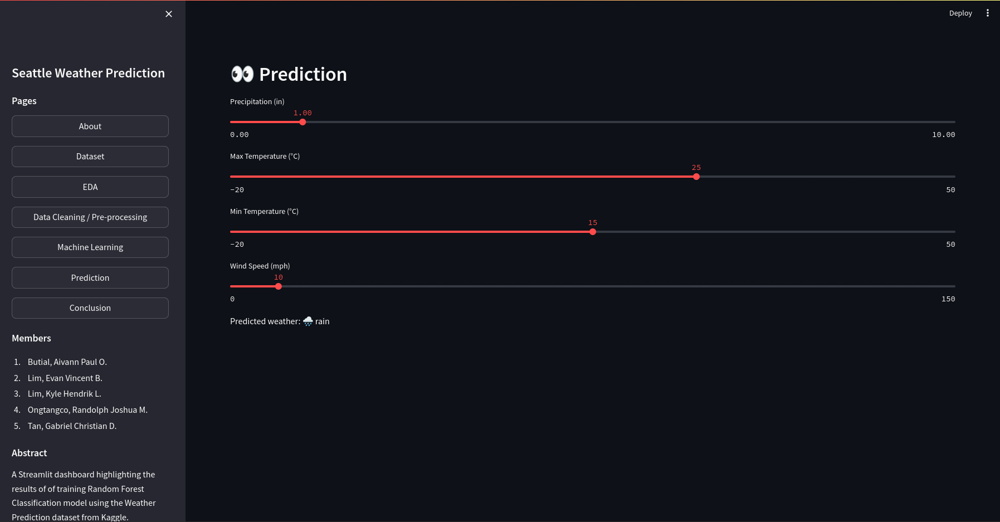

# Seattle Weather Prediction Dashboard

A Streamlit web application that performs **Exploratory Data Analysis (EDA)**, **Data Preprocessing**, and **Supervised Machine Learning** to predict weather conditions from the Seattle Weather Prediction dataset. The application uses Random Forest Classifier to forecast different weather conditions such as drizzle, rain, sun, snow, and fog.

### 🔗 Links:

- 🌐 [Streamlit Link](https://zeraphim-iris-classification-dashboard.streamlit.app/)
- 📗 [Google Colab Notebook](https://colab.research.google.com/drive/1xwaCdEhWPi_2sUwpqr9Mp2uCdcOyj45_#scrollTo=MQo1i9FqwRfd)

### 📊 Dataset:

- [Weather Prediction (Kaggle)](https://www.kaggle.com/datasets/ananthr1/weather-prediction)

### 📖 Pages:

1. `Dataset` - Brief description of the Seattle Weather Prediction dataset used in this dashboard, including features like precipitation, temperature, and wind.
2. `EDA`- Exploratory Data Analysis of the Seattle Weather Prediction dataset. This section provides insights into the distribution of weather types and the relationships between weather features. It includes visualizations such as Pie Charts and Line Graphs.
3. `Data Cleaning / Pre-processing` - Data cleaning and preprocessing steps, including handling missing values, encoding weather types, and splitting the dataset into training and testing sets.
4. `Machine Learning`- Training supervised classification models, using **Random Forest Classifier**. This section also includes model evaluation and feature importance analysis to identify the key factors influencing weather predictions.
5. `Prediction` - An interactive page where users can input values for features such as temperature, precipitation, and wind to predict the weather condition using the trained models.
6. `Conclusion` - Summary of the key insights and observations from the EDA and model training phases. This section also discusses the strengths and limitations of the models and potential areas for further improvement.

### 💡 Findings / Insights

Through exploratory data analysis and training `Random Forest Classifier` on the **Weather Prediction Dataset**, the key insights and observations are:

#### 1. 📊 **Dataset Characteristics**:

- The dataset shows high variation across the **sepal and petal** features. `petal_length` and `petal_width` has higher variability than the sepal features further suggesting that these features are more likely to distinguish between the three Iris flower species.
- All of the three Iris species have a **balanced class distribution** which further eliminates the need to rebalance the dataset.

#### 2. 📝 **Feature Distributions and Separability**:

- **Pairwise Scatter Plot** analysis indicates that `Iris Setosa` forms a distinct cluster based on petal features which makes it easily distinguishable from `Iris Versicolor` and `Iris Virginica`.
- **Petal Length** emerged as the most discriminative feature especially for distinguishing `Iris Setosa` from other Iris species.

#### 3. 📈 **Model Performance (Decision Tree Classifier)**:

- The `Decision Tree Classifier` achieved 100% accuracy on the training data which suggests that using a relatively simple and structured dataset resulted in a strong performance for this model. However, this could also imply potential **overfitting** due to the model's high sensitivity to the specific training samples.
- In terms of **feature importance** results from the _Decision Tree Model_, `petal_length` was the dominant predictor having **89%** importance value which is then followed by `petal_width` with **8.7%**.

##### **Summing up:**

Throughout this data science activity, it is evident that the Iris dataset is a good dataset to use for classification despite of its simplicity. Due to its balanced distribution of 3 Iris flower species and having 0 null values, further data cleansing techniques were not used. 2 of the classifier models trained were able to leverage the features that can be found in the dataset which resulted to a high accuracy in terms of the two models' predictions. Despite of the slight overlap between Iris Versicolor and Iris Virginica, the two models trained were able to achieve high accuracy and was able to learn patterns from the dataset.